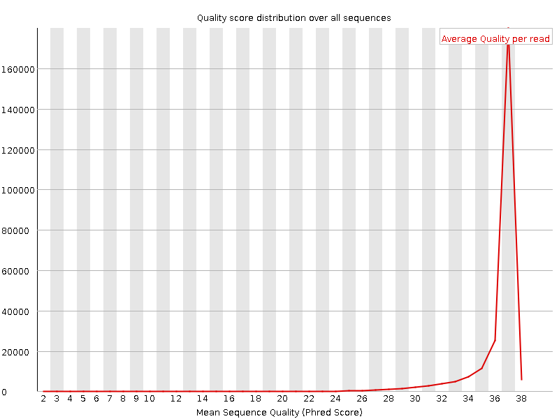
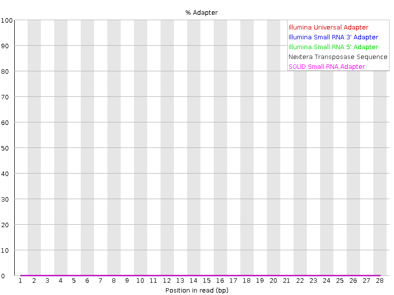

|CyVerse logo|_

|Home_Icon|_
`Learning Center Home <http://learning.cyverse.org/>`_

Evaluate High-throughput Sequencing Reads with FastQC
=====================================================

..
    #### Comment: Use short, imperative titles e.g. Upload and share data, uploading and
    sharing data ####

Goal
----

The `FastQC <https://www.bioinformatics.babraham.ac.uk/projects/fastqc/>`_
software is a popular way to evaluate the quality of high-throughput sequencing
reads (e.g. reads from Illumina or PacBio sequencing). This quickstart won't go
into all of the nuances of interpreting these results (see instead the
official `FastQC Documentation <https://www.bioinformatics.babraham.ac.uk/projects/fastqc/Help/>`_ ).
Rather, we will get you using the tool right away in the Discovery Environment.

..
    Avoid covering upstream and downstream steps that are not explicitly and
    necessarily part of the tutorial - write or link to separate quick
    starts/tutorials for those parts

..
    #### Comment: A few sentences (50 words or less) describing the ultimate goal of the steps
    in this tutorial ####

----

Prerequisites
-------------

Downloads, access, and services
~~~~~~~~~~~~~~~~~~~~~~~~~~~~~~~

*In order to complete this tutorial you will need access to the following services/software*

	.. list-table::
	    :header-rows: 1

	    * - Prerequisite
	      - Preparation/Notes
	      - Link/Download
	    * - CyVerse account
	      - You will need a CyVerse account to complete this exercise
	      - `Register <https://user.cyverse.org/>`_

Platform(s)
~~~~~~~~~~~

*We will use the following CyVerse platform(s):*

..
	#### Comment: Modify the table below as needed ####

.. list-table::
    :header-rows: 1

    * - Platform
      - Interface
      - Link
      - Platform Documentation
      - Learning Center Docs
    * - Data Store
      - GUI/Command line
      - `Data Store <http://www.cyverse.org/data-store>`_
      - `Data Store Manual <https://wiki.cyverse.org/wiki/display/DS/Data+Store+Table+of+Contents>`_
      - `Guide <https://cyverse-data-store-guide.readthedocs-hosted.com/en/latest/>`__
    * - Discovery Environment
      - Web/Point-and-click
      - `Discovery Environment <https://de.cyverse.org/de/>`_
      - `DE Manual <https://wiki.cyverse.org/wiki/display/DEmanual/Table+of+Contents>`_
      - `Guide <https://learning.cyverse.org/projects/discovery-environment-guide/en/latest/>`__

Input and example data
~~~~~~~~~~~~~~~~~~~~~~

*In order to complete this quickstart you will need to have the following inputs prepared*

.. list-table::
    :header-rows: 1

    * - Input File(s)
      - Format
      - Preparation/Notes
      - Example Data
    * - Sequencing reads
      - `FastQ <https://en.wikipedia.org/wiki/FASTQ_format>`_
      - Any sequencing reads in FastQ format will work. They do not
        need to be pre-processed. They may also be compressed (e.g.
        fastq.gz)
      - `SRR1028781.fastq <http://datacommons.cyverse.org/browse/iplant/home/shared/cyverse_training/quickstarts/fastqc/SRR1028781.fastq>`_

-----

*Get started: Evaluate Reads with FastQC*
-----------------------------------------

.. Tip::

	If you have not already imported your own sequence read files to CyVerse,
	you can follow the instructions for uploading data, for example using
	Cyberduck, in our `Data Store guide <https://cyverse-data-store-guide.readthedocs-hosted.com/en/latest/step1.html>`_

1. Login to the `Discovery Environment <https://de.cyverse.org/de/>`__

2. Click `FastQC 0.11.5 (multi-file) <https://de.cyverse.org/de/?type=apps&app-id=dbd0de10-97da-11e6-8f91-008cfa5ae621&system-id=de>`_
   to open the App, or click on Apps in the DE workspace and search for and run
   this App.

3. Under “Analysis Name” leave the defaults or make any desired notes.

4. Under “Select Input data” for ‘Input file, click Browse, then navigate to and
   select one or more FastQ files to analyze; Then click OK.

   .. Note::

	    To use our example data, navigate to *Community Data >*
	    *cyverse_training > quickstarts > fastqc and select the SRR1028781.fastq file.*

5. Click Launch Analysis. You will receive a notification and may close the
   Apps window.

6. Click on Analyses from the DE workspace and monitor the status of your
   submitted job (You may have to click refresh to view updated status).

7. In the Analysis console, once your status appears as ‘Completed,’ click
   on the name of your analysis to navigate you to the results. Download the
   result files (in zip format) using the simple download, unzip the files and
   open the results in a web browser.

----

*Summary*
~~~~~~~~~~~

Analyzing a FastQC report, you can evaluate the quality of your sequencing
results. The best way to interpret this report is to consult the official
`FastQC Documentation`_. You should keep in mind that simply because individual
reports may generate a warning or fail, this does not mean your data are
unusable. In most cases poor quality reads can be eliminated by subsequent
cleaning steps without losing a large amount of sequence. Some reports such as
'Sequence Duplication Levels' might generate a warning when analyzing RNA-Seq
data where you have many highly expressed transcripts. Here are a few tips:

  .. Tip::

	 Here are some of the most important reports to consider in downstream cleaning
	 steps. Having a fail on these reports would require careful evaluation of
	 whether or not the data can be sufficiently cleaned to be useful. These tips
	 may not apply in every situation, you will have to interpret or seek advice
	 on your own results.

	 **Per base sequence quality**

	 |perbase_good|

	 This report shows the average quality score across the length of all reads.
	 Poor quality at the beginning or end of the reads may suggest settings for
	 trimming.

	 **Per sequence quality scores**

	 |persequence_good|

	 This report indicates how individual reads of a given quality score are
	 distributed in your sequence file. Ideally, most reads will have a high
	 average quality score. Populations of lower average-scored reads can be
	 removed by downstream filtering.

	 **Adapter Content**

	 |adapter_good|

	This report indicates the presence of sequencing adapters. If adapters are
	detected, you will need to remove them in downstream cleaning.

**Next Steps:**

Following your report, you may wish to apply one of several tools in the
Discovery Environment to, for example, remove sequencing adaptors and trim
low quality portions of reads. The `Trimmomatic App <https://wiki.cyverse.org/wiki/display/DEapps/Trimmomatic-programmable-0.33>`_ is suggested.

----

Additional information, help
~~~~~~~~~~~~~~~~~~~~~~~~~~~~
See the original `FastQC Documentation`_ for all the instructions on how to use
this tool and interpret reports.

Search for an answer: `CyVerse Learning Center <http://learning.cyverse.org>`_ or `CyVerse Wiki <https://wiki.cyverse.org>`_

Post your question to the user forum:
`Ask CyVerse <http://ask.iplantcollaborative.org/questions>`_

----

**Fix or improve this documentation**

- On Github: `Repo link <https://github.com/CyVerse-learning-materials/fastqc_quickstart>`_
- Send feedback: `Tutorials@CyVerse.org <Tutorials@CyVerse.org>`_

----

|Home_Icon|_
`Learning Center Home <http://learning.cyverse.org/>`_

.. |CyVerse logo| image:: ./img/cyverse_rgb.png
    :width: 500
    :height: 100
.. _CyVerse logo: http://learning.cyverse.org/
.. |Home_Icon| image:: ./img/homeicon.png
    :width: 25
    :height: 25
.. _Home_Icon: http://learning.cyverse.org/
.. |perbase_good| image:: ./img/perbase_good.png
    :width: 250
    :height: 200

